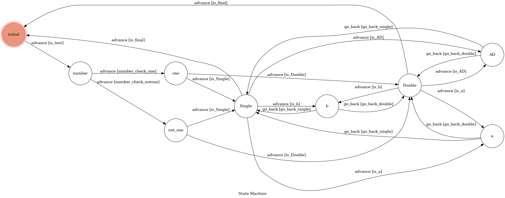

# LineBot Project
Code for My first LineBot app

Based on a finite state machine & basic Message reply, Image reply

## Setup
* Ubuntu 20.04 LTS Desktop version
* Python 3.6.15
* Pipenv
* flask==1.0.2
* python-dotenv==0.10.3
* pygraphviz==1.5
* transitions==0.6.9
* line-bot-sdk==1.14.0

## Illustration
* This app is used to help students know how to have a quickstart for
  their badminton basic trainning
* Whether you want to train for Single match or Double match, this chat bot
  will give you some advices as long as you provide some information by entering on line app
* And then, to increase in convenience of usage of this linebot, there is no final state,  
  because the users may want to check another option after new friends join or changing mind for match. At the end of the state, fsm will go to initial state to let you use more times
## Usage
* At the beginning, type arbitrary string to wake up the linebot
* Next, type "1" or "one" to let bot know there is only one trainer, or otherwise, "2"  
  "arbitrary string" to indicate that there are 2 or more trainers 
* Then, linbot will remind you of selecting the type of match. "Single" for Single match
  "Double" for Double match
* In the end, the linebot will give you the trainning menu, and provides some details links   
  as long as the user type corresponding character.
* type "end" to restore the machine state to "initial state"
## Finite State Machine

## Reference
[Pipenv](https://medium.com/@chihsuan/pipenv-更簡單-更快速的-python-套件管理工具-135a47e504f4)

[TOC-Project-2020](https://github.com/NCKU-CCS/TOC-Project-2020?fbclid=IwAR33irsvnX_X14wSJZtmf7XBjSjNRGpNH5PISMRa-NS3vbcfrsSqs2sT7JA)

[Line line-bot-sdk-python](https://github.com/line/line-bot-sdk-python/tree/master/examples/flask-echo)

[Linebot python tutorial](https://youtu.be/i8ncIcJs-LA)
